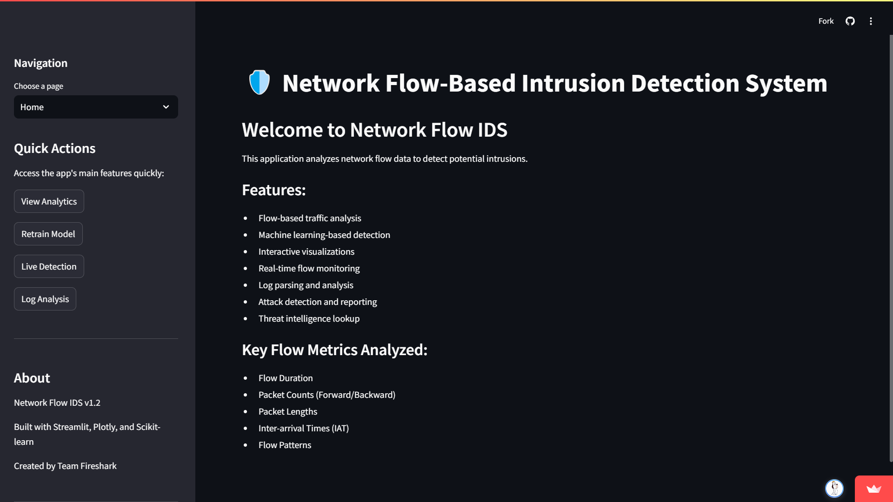
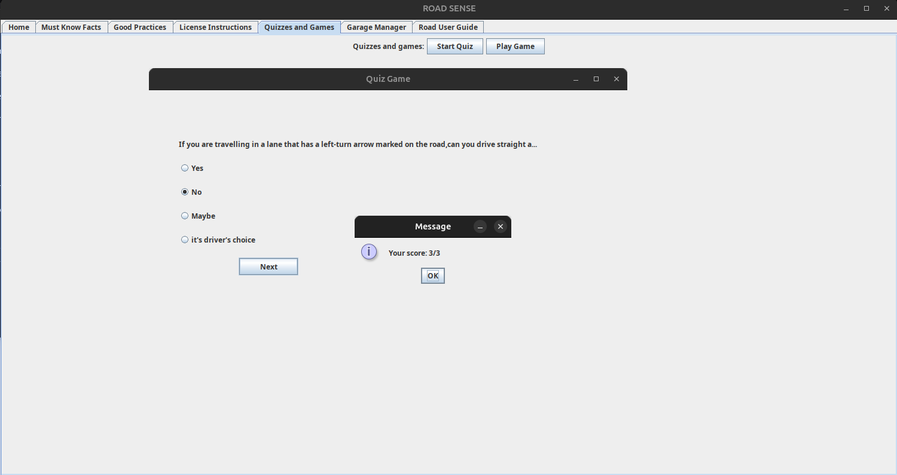
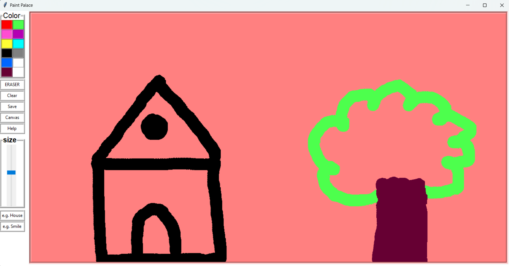

<h1 align="center">Hi 👋, I'm Rajan Raj</h1>
<h3 align="center"> The harder the problem, the more interesting the solution. </h3>

    <h2>About Me:</h2>
    

        

            <ul>
                <li>🌱 CS Engineer - I do backend, AI/ML & stuff.</li>
                <li>🧩 I work on frontend just as much as a fullstack dev does.</li> 
                <li>💡 Solving complex problems through competitive programming.</li>
                <li>💬 Love to build innovative solutions and share knowledge with the community.</li>
                <li>⚡ Fun Fact: <strong>Even an empty array holds a lot of feelings (undefined ones).</strong></li>
                <li>📫 Reach me at <strong>rajanraj253545@gmail.com</strong>.</li>
            </ul>
        

        
    

###

## 🏆 Competitive Programming Profiles  

<table border="0">
  <tr>
    <td align="center">
      <a href="https://leetcode.com/YOUR_USERNAME">
        
         <b>LeetCode - rajanraj22</b>
      </a>
    </td>
    <td align="center">
      <a href="https://www.codechef.com/users/YOUR_USERNAME">
        
         <b>CodeChef - devrajanraj</b>
      </a>
    </td>
    <td align="center">
      <a href="https://codeforces.com/profile/YOUR_USERNAME">
      

        
        

         <b>Codeforces - rajanraj</b>
      </a>
    </td>
  </tr>
</table>

###

## 💻 Tech Stack

  
  
  
  
  
  
  
  
  
  
  
  
  
  
  
  
  
  
  
  
  
  
  
  
  
  
  
  
  
  
  
  
  
  
  
  
  
  
  

## Github Stats

  

  

###

### 🔝 Top Contributed Repo

###

## 🚀 Featured Projects

### 🔗 [Fashion Fusion](https://github.com/rajanraj2/FashionFusion.git)  
AI-powered fashion recommendation system that detects the type of cloth from image using AI and suggests outfits based on trends and personal style.  

### 🔗 [Fireshark](https://github.com/rajanraj2/Fireshark.git)    
A network security analysis tool designed to detect vulnerabilities and unusual patterns in traffic.  

### 🔗 [Road Sense](https://github.com/rajanraj2/Road_Sense.git)    
Java-based road safety awareness game with a QuizGame and DrivingSchool module. 
<!--    -->

### 🔗 [Paint Palace](https://github.com/rajanraj2/Paint_App.git) 
A fun and interactive drawing/painting app built using Tkinter in Python.  

###
## 🌐 Connect with Me

  
<!--    -->
  
  
  

###

 

<!--  -->

## 🤝 Let's Collaborate!
💡 Feel free to connect, collaborate, or just say hi! Let's build something awesome together. 🚀
